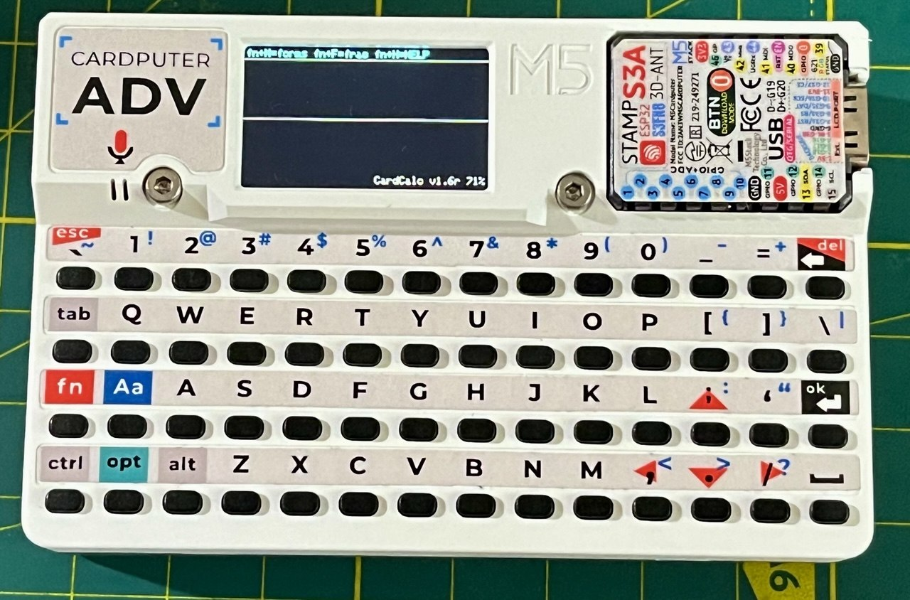
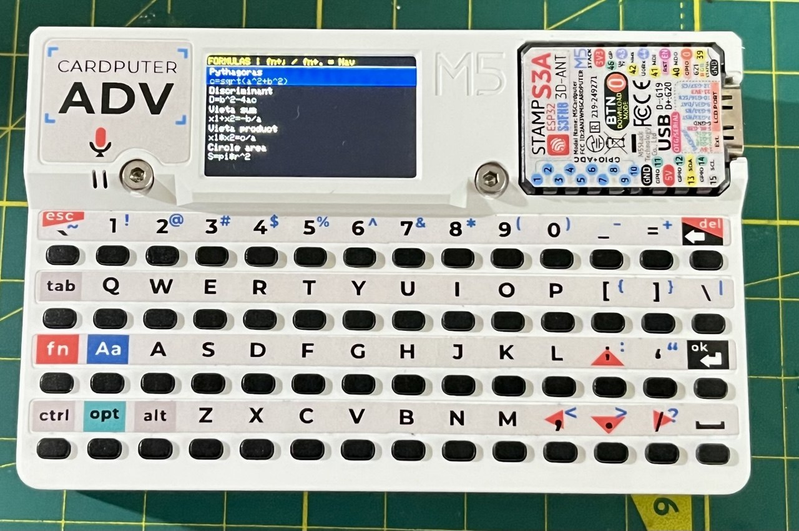
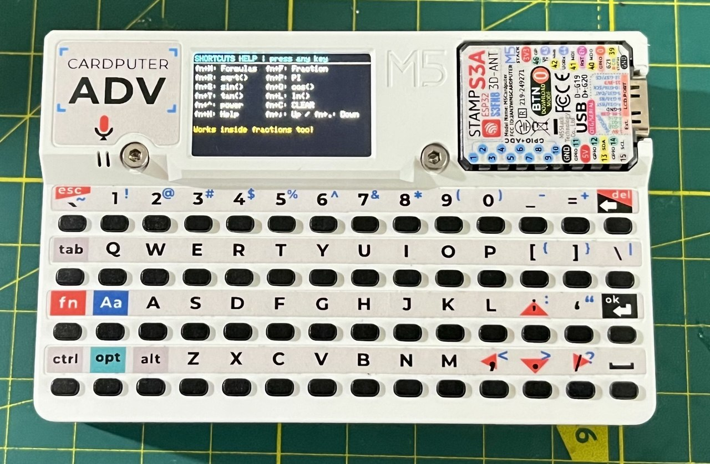

# 🧮 CalcPuter

A feature-rich calculator firmware for the **M5Stack Cardputer**, built in C++. Supports expression evaluation, built-in math formulas, fraction input, and a help screen — all designed for the Cardputer's tiny keyboard and display.

---

## 📸 Screenshots

| Main Calculator | Formula Menu | Help Screen |
|:-:|:-:|:-:|
|  |  |  |

---

## ✨ Features

### 🔢 Expression Calculator
- Type and evaluate full math expressions like `2*(3+4)^2`
- Supports operator precedence, parentheses, and negative numbers
- Displays the expression on top and the result below
- Error messages for invalid input (e.g. division by zero, syntax errors)

### 📐 Built-in Formulas (12 total)
Navigate a formula menu, enter variables, and get instant results:

| Formula | Expression |
|---|---|
| Pythagorean theorem | `c = sqrt(a² + b²)` |
| Discriminant | `D = b² - 4ac` |
| Vieta's sum | `x1 + x2 = -b/a` |
| Vieta's product | `x1 * x2 = c/a` |
| Circle area | `S = π·r²` |
| Circumference | `C = 2·π·r` |
| Law of cosines | `c = sqrt(a²+b²−2ab·cos C)` |
| Law of sines | `b = a·sin(B)/sin(A)` |
| Sphere volume | `V = (4/3)·π·r³` |
| Trapezoid area | `S = (a+b)/2·h` |
| Logarithm base b | `log_b(x) = ln(x)/ln(b)` |
| Nth root | `x^(1/n)` |

### ➗ Fraction Input Mode
Enter a numerator and denominator separately — the result is inserted directly into the expression as `(num)/(den)`, so you can keep computing with it. Supports full math inside each part (trig, sqrt, pi, etc.).

### ⌨️ Keyboard Shortcuts (Fn + key)
| Shortcut | Action |
|---|---|
| `Fn + H` | Open Help screen |
| `Fn + M` | Open Formula menu |
| `Fn + F` | Fraction input mode |
| `Fn + R` | Insert `sqrt(` |
| `Fn + S` | Insert `sin(` |
| `Fn + O` | Insert `cos(` |
| `Fn + T` | Insert `tan(` |
| `Fn + L` | Insert `ln(` |
| `Fn + P` | Insert `pi` |
| `Fn + C` | Clear expression |
| `Fn + ^` | Insert `^` (exponent) |
| `Enter` | Evaluate expression |
| `Del` | Backspace |

### 🧮 Supported Math Functions
`sin`, `cos`, `tan`, `asin`, `acos`, `atan`, `sinh`, `cosh`, `tanh`, `sqrt`, `ln`, `log` (base 10), `abs`, `floor`, `ceil`, `round`, `exp`

Constants: `pi`, `PI`

---

## 🛠️ Building & Flashing

### Requirements
- [PlatformIO](https://platformio.org/) or Arduino IDE with ESP32 board support
- M5Stack library: `M5Cardputer`

### PlatformIO (recommended)
```ini
[env:m5stack-cardputer]
platform = espressif32
board = m5stack-cardputer
framework = arduino
lib_deps = m5stack/M5Cardputer
```

```bash
pio run --target upload
```

### Arduino IDE
1. Install board: `ESP32 by Espressif` via Board Manager
2. Install library: `M5Cardputer` via Library Manager
3. Select board: **M5Stack Cardputer**
4. Upload `main.cpp`

---

## 📦 Hardware

| | |
|---|---|
| **Device** | M5Stack Cardputer |
| **MCU** | ESP32-S3 |
| **Display** | 240×135 TFT |
| **Input** | Built-in QWERTY keyboard |

---

## 📁 Project Structure

```
├── src/
|   ├── main.cpp
|   ├── tinyexpr.c
|   └── tinyexpr.h
├── photos/
│   ├── generalmenu.jpg
│   ├── formulas.jpg
│   └── helpmenu.jpg
└── README.md
```

---

## 📜 License

MIT License — do whatever you want, attribution appreciated.
